# Avast Cleanup Walkthrough

Index
* [Installation](#installation)
* [UnInstallation](#uninstallation)
* [Activation](#activation)
* [Setup](#setup)
* [Major Features](#major features)
* [Lesson Learned from Legacy Defect/Tracker](#lesson learned from legacy defect/tracker)
* [Lesson Learned from Beta Customer/Forum](#lesson learned from beta customer/forum)

---

## Installation
* AUT (a.k.a. APP under Testing) should be installed successfully on target devices

## UnInstallation
* AUT (a.k.a. APP under Testing) should be uninstalled successfully on target devices

---

## Activation
1. First Activity show correctly
 * 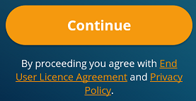  
   [link to Full Screenshot](AvastCleanup/001-001.png)
2. Components and hyperlink work
 * button "Continue" works for leading user to next activity
 * hyperlink for "End User Licence Agreement" and "Privacy Policy" work
3. L10N works
 * for example,
  * Traditional Chinese and Simplified Chinese should not be mixed
  * 
  * (Culture Correctness for Japan) All english sentences should be translated to Japanese

---

## Setup
1. Permission grants successfully
2. Plan B if Permission Deny (while user click "DENY" on Popup Window)
 1. 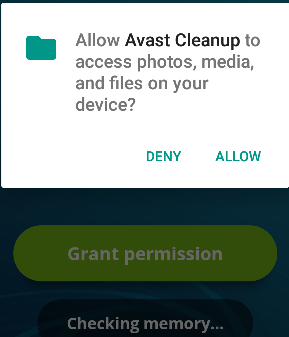  
    [link to Full Screenshot](AvastCleanup/002-001.png)
 2. 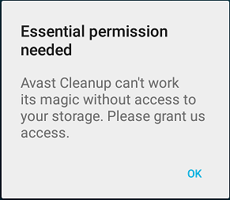  
    [link to Full Screenshot](AvastCleanup/002-002.png)
 3. 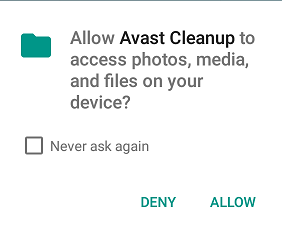
3. Plan C if Permission Deny Eventually (while user click "DENY" and check "Never ask again")
 * Button "Grant permission" guide (advnaced) user to re-setup permission  
   [link to Full Screenshot](AvastCleanup/002-004.png)  
   [link to Full Screenshot](AvastCleanup/002-005.png)  
   [link to Full Screenshot](AvastCleanup/002-006.png)  
   [link to Animation](AvastCleanup/002-007.gif)  
   [link to Animation](AvastCleanup/002-008.gif)  

## Initialization
1. Before first time of storage analyzation, it is supposed to update database if networking is available.  
 * [link to Full Screenshot](AvastCleanup/003-001.png)
2. After first time of stotrage analyzation, user should be guide to next step by highlight follow-up steps.  
 * [link to Full Screenshot](AvastCleanup/003-002.png)  
 * [link to Animation](AvastCleanup/004.gif)
3. First time to customize options of "Safe Clean"
 * 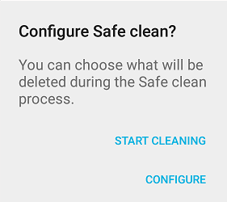
 * [screenshot](AvastCleanup/005-003.png)
 * [animation](AvastCleanup/005-002.gif)
4. Hint: User can change configuration anytime at TOOLS -> Settings

---

## Major Features

* [Advertisement](#ad)
* [Cleaning](#clearning)
* [Tools](#tools)
* [Media & Files](#media & files)
* [Apps](#apps)

### UI for Status update

* show how many space left:  
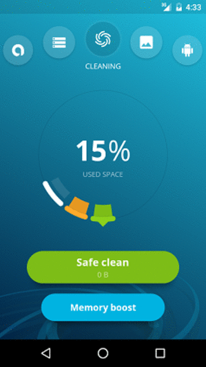
 * ??% USED SPACE
 * ??GB FREE

---

### CLEANING

#### Safe Clean

Configuration
* User can customize detail options in [Settings](#setting), which is under [TOOLS](#tools) tab

User-Interaction ([animation](AvastCleanup/006-001.gif))
* Action
 * everything, which is suppoed to be purged, should be purged successfully
    * i.e. blacklisting and heuristic rules
 * everything, which is not alllowed to be purged, should NOT be purged
    * i.e. whitelisting
* Result [screenshot](AvastCleanup/006-002_show_result.png)
* Leading to advertisement page [screenshot](AvastCleanup/006-003_show_ad.png)

#### Memory Boost

Configuration [screenshot](AvastCleanup/007-001.png)
* User check those APPs (i.e. long-live, whitelisting) for reservation
* User unckeck those APPs (i.e. unwantted, blacklisting) to kill for memroy saving
* System APPs should be listed carefully, no matter for common user or power user
 * i.e. Android Keyboard, Google Play Services, etc.
* User APPs should be listed all, excepting supervisor ones
 * i.e. Cleanup APPs itself, Mobile Security APPs, etc.

User-Interaction
* Result [screenshot](AvastCleanup/007-002.png)
 * Statistic is well-printing for user  
 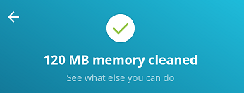  
 * Worth noticing   
 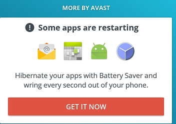  
* Leading to advertisement page [screenshot](AvastCleanup/007-003.png)

---

### AD

* MORE BY AVAST  
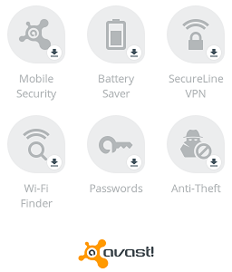   
[screenshot](AvastCleanup/AD_001.png)
* User-Interaction
 * The listing Apps, which has not been installed yet, should be grayed-out
   * The grayed-out Apps (icon) is click-able.
   * After user click one of grayed-out App, Play Store or default web browser will be envoked and link to target App installation page.
 * The listing Apps, which has been installed, should be highlighted?
   * The highlighted App (icon) is click-able.
   * After user click one of highlighted App, user will be leaded to main activity of target App.  
   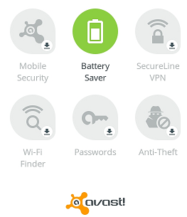   
   [screenshot](AvastCleanup/AD_002.png)

* AD frame anywhere
 * There should be no deadlink for out-going.
 * Plan B if the target device works without networking.
 * Each out-going link should be evaluated as safe by backend service in advnace.

---

### TOOLS
[screenshot](AvastCleanup/TOOLS_001.png)   
#### User-Interaction
* Statistic is well-printing for user  
Question? B for byte? It seems not userful for common user.
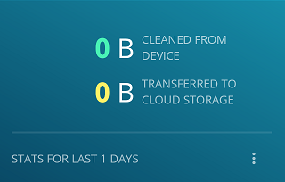
* User is able to reset all counters of historic statistic  
[screenshot](AvastCleanup/TOOLS_001s1.png) -> [screenshot](AvastCleanup/TOOLS_001s2.png)

#### Help & Feedback

* FAQS [screenshot](AvastCleanup/Help_001.png)  
 * Trending
 * Storage
 * Appication and App data
 * Media and file
 * General
* Two Feedback Channels [screenshot](AvastCleanup/Help_003.png)
 * Share your opioion with the Avast community
   * Default web browser is launched to open https://forum.avast.com/
 * Share your opinion directly with the development team [screenshot](AvastCleanup/Help_004.png)
   * User can send feedback back to Dev team without leaving current App

Question?
* How to prevent possible Email Bounce Attack for user-provided email address?  [screenshot](AvastCleanup/Help_005.png)
* How about default page when networking is not available?
 * 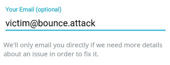
* How about web page caching in case of network bandwidth saving?
 * 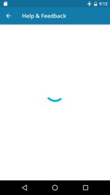

#### Settings
[Settings](#setting)

---

### MEDIA & FILES
[screenshot](AvastCleanup/Media_001.png)
* let user move local files (beloing to certain groups) to 3rd party vendors providing cloud storage service
* media types
 * photos, video, music
 * documents, other files

Question?
* Are the grouping rules defined by file extention names or true file type detection?
* How about letting user to define groups by file extension names or folder path

---

### APPS

* Listing Installed Apps and Unnused ones  
[screenshot](AvastCleanup/Apps_001-001.png)
 * If user click "LARGE APPS" button, page (sorting by size) is landing [screenshot](AvastCleanup/Apps_001-002.png)
 * If user click "LARGE APPS" button, page (sorting by usage/used recently) is landing [screenshot](AvastCleanup/Apps_001-003.png)
 * Apps can be sorted by demand [animation](AvastCleanup/Apps_001-004.gif)
 * Four actions can be performs on those/selected Apps [screenshot](AvastCleanup/Apps_001-005.png)
   * Jump to (folder of target App)
   * Add to ignore list (files belonging to target App)
    * App (listed in ignore list) can also be removed from ignore list
   * Select all
   * Deselect all
 * More detail options can be performed on the target Apps
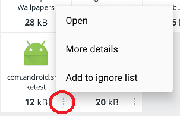  
[animation](AvastCleanup/Apps_001-007.gif)
* Statistic for
 * Applications
 * App Data  
   * UI defect found  
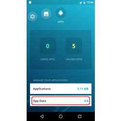

---

### Setting
[screenshot](AvastCleanup/Setting_000.png)
* Safe cleaning [(Screenshot #1)](AvastCleanup/Setting_001_Safe_cleaning_1.png) [(Screenshot #2)](AvastCleanup/Setting_001_Safe_cleaning_2.png)
 * Safe Clean Check
   * User has chance to decide go/not-go before App deletes particular data
 * Customized options for file deletion (under Safe Clean)
     * Thumbnails, preview version pictures (i.e. Camera, Facebook, ...)
     * Hidden Cache (i.e. Youtube or HERE WeGO?)
     * Visible Cache (i.e. browser?)
     * APKs (i.e. downloaded APK files, which was left after installation?)
     * Residual file, left by uninstalled App
     * Shared Cache, (i.e. advertisement)
* Notifications [(screenshot)](AvastCleanup/Setting_002_Notifications.png)
 * Unused app(s) reminder
   * Once timer (1/2 weeks or 1 month) triggered, user will be notified with list of unused apps
 * Storage space warning
   * Once only 5%/10%/25%/50% space is left, user will get a warning.
 * Dispensable data reminder
   * Once total size of candidarte files waiting-to-be-deleted, in 10/25/50/100/250 MB, user will get a reminding.
 * Media transfer reminder
   * Once total size of candidarte files waiting-to-be-uploaded-to-cloud, in 100/250/500/750 MB or 1GB, user will get a reminding.
 * Cleaning adviser alert
   * Once total size of candidarte files recommended-to-be-deleted, in 100/250/500 MB, user will get a reminding.
* Cloud services [(screenshot)](AvastCleanup/Setting_003_Cloud_services.png)
 * Integrating with 3rd party cloud storage venders
    * Dropbox
    * Google Drive
    * OneDrive
  * Additional operations
    * delete files after transfer
     * After those labeled files are uploaded to Cloud, storage space allocated to those files will be released.
    * upload files only on Wi-Fi
     * App use only Wi-Fi but not Cellular networking when transfering files to the cloud storage.
* Trash review
 * User is able to review items before they are purged.
* Memory Booster Check
 * User can make a decision before Memroy Booster purge particular apps.
* About
 * Name, Version, last update date, wording and icon will be provided correctly
 * Name, license and project source like of involved Open source librarys are listed up-to-date.
 * EULA / end user license agreement is provided, in local language, with compliance with local laws
 * Audience Network, (of Facebook)

Question? Why not move "Setting" to rightest side tab or top right-hand corner to align common practice?

* 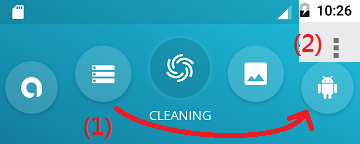

---

## Lesson Learned from Legacy Defects/Trackers
...

## Lesson Learned from Beta Customer / Forum / Community
* Forum https://forum.avast.com/
* Beta Program https://play.google.com/apps/testing/com.avast.android.cleaner
* Community https://plus.google.com/communities/112394513906169233317
